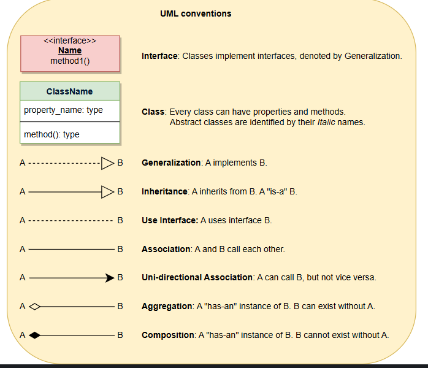

# Software Design and Architecture Specialization

## 📌 Design patterns course

### This course focuses on applying object-oriented design principles to create flexible and scalable software systems.

---

### Module 1: Introduction to Design Patterns: Creational & Structural Patterns

- Design patterns are practical, proven solutions to recurring software design problems. They provide a structured
  approach to software development, allowing developers to leverage industry-tested solutions rather than building
  everything from scratch.

- **Why Use Design Patterns?**
    - **Proven Solutions:** Expert developers have tested and refined them over time.
    - **Improved Code Structure:** Helps avoid tangled, unstructured "spaghetti code."
    - **Conceptual Guidance:**-- Not just code snippets, but principles that improve software flexibility and
      reusability.
    - **Efficient Communication:** Provides a common vocabulary for discussing design choices, reducing
      misunderstandings.
- **Pattern Languages**
    - The Gang of Four (GoF) design patterns serve different purposes depending on the problem context. A pattern
      language is a collection of related design patterns suited to a specific problem space. For example:
        - Accounting Software – Uses patterns related to double-entry bookkeeping and financial transactions.
        - Gaming Software – Uses patterns suited for game mechanics, rendering, and state management.
- **Categories**
    - **Creational Patterns:** Creational patterns tackle how you handle creating or cloning new objects. Cloning an
      object occurs when you are creating an object that is similar to an existing one, and instead
      of instantiating a new object, you clone existing objects instead of instantiating them.
      Creational patterns depend on the programming language being used.
        - **Singleton** having only one object of a class. Object should be accessible globally. Object not created
          until it is needed to be called as lazy creation. There are trade-offs to the Singleton design principle. If
          there are multiple computing threads running, there could be issues caused by the threads trying to access the
          shared single
          object.
        - **Factory Pattern**
            - The Factory Method Pattern defines an interface for creating objects, but allows subclasses to alter the
              type of
              objects that will be created. It provides a way to delegate the instantiation of objects to subclasses,
              promoting
              flexibility and reducing tight coupling between client code and concrete classes. The Factory Method
              pattern in
              Java is a Creational design pattern used to create objects without specifying the
              exact class that will be instantiated. Instead of calling a constructor directly, we delegate the object
              creation
              to a factory method.
            - Key concepts
                - Encapsulation of Object Creation – The exact class of the object to be created is hidden from the
                  client.
                - Promotes Loose Coupling – The client depends on an interface or abstract class, not concrete
                  implementations.
                - Enhances Maintainability – Easier to modify object creation logic without affecting the client code.
            - In the Factory Design Pattern, the terms Product and Factory refer to the roles that different classes
              play in
              object creation
                - Product: The Product is the object that the factory creates. It is usually an interface or an abstract
                  class
                  that defines the structure of the objects that will be produced like Shape interface with Draw method.
                  Concrete implementations of the product extend or implement this structure like Circle extends Shape.
                - Factory: The Factory is the class that creates the Product. It is an interface or an abstract class
                  that
                  defines the method to create the Product. Concrete implementations of the factory create specific
                  products
                  like ShapeFactory implements Factory. The factory method ensures that the object creation logic is
                  centralized
                  and follows the Open/Closed Principle (open for extension, closed for modification)
        - Factory method pattern structure(true for most cases)
            - Product Interface (or Abstract Class) – Defines the common interface for all products.
            - Concrete Product Classes – Implement the product interface.
            - Creator (Factory Class) – Declares a method to return objects of type Product.
            - Concrete Creator(s) – Implement the factory method to create specific products.
        - **Abstract Factory Pattern**
            - The Abstract Factory Method Pattern provides an interface for creating families of related or dependent
              objects
              without specifying their concrete classes. It involves multiple factory methods, each responsible for
              creating
              different types of related products, ensuring consistency across families of objects. The Abstract Factory
              pattern
              is a Creational design pattern that provides an interface for creating families of
              related or dependent objects without specifying their concrete classes. It is a super-factory that creates
              other
              factories. The Abstract Factory pattern is also known as the Kit pattern.
            - Abstract Factory pattern structure
                - Abstract Factory Interface – Declares a set of methods to create products.
                - Concrete Factory Classes – Implement the factory interface to create products.
                - Abstract Product Interface – Declares a set of methods that all products will implement.
                - Concrete Product Classes – Implement the product interface.
            - The Abstract Factory pattern is useful when you need to create a family of related objects. For example,
              if you
              have a GUI library, you might have a set of classes that create buttons, text fields, and other GUI
              components.
              The Abstract Factory pattern allows you to create a factory that creates all of these components. The
              Abstract
              Factory pattern is also useful when you need to create objects that are related to each other. For
              example, if you
              have a set of classes that represent different types of animals, you might have a factory that creates all
              of
              these
              animals.
        - **Builder Pattern**
            - The Builder pattern is a Creational design pattern that allows you to create complex objects step by step.
              It is
              useful when you need to create an object that requires a lot of configuration. The Builder pattern is
              similar to
              the Abstract Factory pattern, but it is more focused on creating complex objects. The Builder pattern is
              useful
              when you need to create an object that requires a lot of configuration. For example, if you have a class
              that
              represents a computer, you might need to set the processor, memory, and hard drive. The Builder pattern
              allows you
              to create a builder that sets each of these properties step by step. The Builder pattern is also useful
              when you
              need to create an object that has a lot of optional properties. For example, if you have a class that
              represents a
              car, you might need to set the color, engine size, and transmission type. The Builder pattern allows you
              to create
              a builder that sets each of these properties step by step.
        - **Prototype Pattern**
    - **Structural Patterns:** describe how objects are connected to each other. These patterns relate to the design
      principles of decomposition and generalization. There are many different ways that you can structure objects
      depending on the relationship you’d like between them. Not only do structural patterns describe how different
      objects have relationships, but they also describe how subclasses and Design Patterns classes interact through
      inheritance. Structural patterns use these relationships and describe how they should work to achieve a particular
      design goal. Each structural pattern determines the various suitable relationships among the objects. A good
      metaphor for considering structural patterns is that of pairing different kinds of foods together: flavor
      determines what ingredients can be mixed together to form a suitable relationship.
        - **Adapter Pattern**
            - Target: The Target is the interface or abstract class that the client code expects. It defines the
              expected behavior but doesn't necessarily have an implementation.
            - Adapter: A bridge between incompatible interfaces. It converts the Adaptee to the Target interface,
              allowing them to work together. The Adapter is the class that adapts the Adaptee to match the Target
              interface, making it compatible with the client code.
            - Adaptee: The Adaptee is the existing or incompatible class that we want to adapt to fit the Target's
              interface.
            - Client
        - **Bridge Pattern**
        - **Composite Pattern**
            - The Composite pattern is a structural design pattern that
              allows you to compose objects into tree structures to represent part-whole hierarchies. The Composite
              pattern is useful when you need to work with objects that form a part-whole hierarchy. For example,
                - if you have a class that represents a file system, you might have a set of classes that represent
                  files and directories. The Composite pattern allows you to treat files and directories in the same
                  way, making it easier to work with them.
                - The Composite pattern is also useful when you need to work with objects that
                  have a recursive structure. For example, if you have a class that represents a company, you might have
                  a set of classes that represent departments and employees. The Composite pattern allows you to treat
                  departments and employees in the same way, making it easier to work with them.
                - it can be use When you want to reduce code duplication by handling both simple and complex elements
                  uniformly.
            - Component
                - Leaf: A Leaf is an end object in the structure. It does not contain any children. Example: In a File
                  System, a File is a Leaf because it cannot contain other files or folders.
                - Composite: A Composite is an object that can contain other objects. It can contain both Leaf and
                  Composite objects. Example: In a File System, a Folder is a Composite because it can contain other
                  files and folders.
        - **Decorator Pattern**
        - **Facade Pattern**
            - The façade design pattern attempts to provide a single, simplified interface for client classes to
              interact with a subsystem. It is a structural design pattern. A façade is a wrapper class that
              encapsulates a subsystem in order to hide the subsystem’s complexity; it acts as a point of entry into a
              subsystem without adding more functionality in itself. The wrapper class allows a client class to interact
              with the subsystem through the façade. A façade might be compared metaphorically to a waiter or
              salesperson, who hides all the extra work to be done in order to purchase a good or service
                - **Flyweight Pattern**
                - **Proxy Pattern**
        - **Behavioural Patterns:** focus on how objects distribute work and describe how each object does a single
          cohesive function. Behavioral patterns also focus on how independent objects work towards a common goal.

---

### Module 2: Behavioural Design Patterns

How individual object collaborate to achieve a common goal.

- **Template Method Pattern**
    - it defines an algorithm steps generally, deferring the implementation of some steps to subclasses. it is concerned
      with the assignment of responsibilities.
    - when you classes with a very similar order of operations, template method could be a option.
    - Template method pattern is a practical application of generalization and inheritance.
- **Chain of Responsibility Pattern**
    - a chain of objects that are responsible for handling requests.
    - Chain of handlers. if a handler cannot handle a request, it will transfer request to next handler.
    - set up a chain of email filter, if a request does not meet one criterion, it goes to next filter.
- **State Pattern**
    - it is used when you need to change the behaviour of an object based upon the state that its in at run time.
- **Command Pattern**
    - this pattern encapsulates the request as an object of its own.
    - Invoker
    - Command
    - Concreate Command
    - Receiver
- **Mediator Pattern**
- **Observer Pattern**
    - it is used when you need to notify a group of objects about a change in state of another object.
    - it is a one-to-many relationship.

---

### Module 3: MVC Pattern

it allows us to separate the concerns of the application into three different components. Model, view and controller.

---

- 